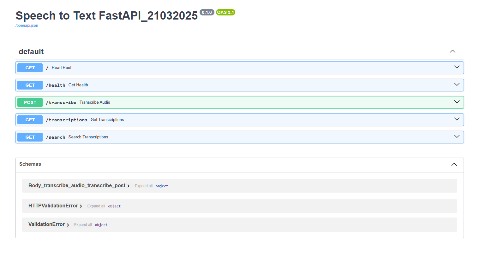

## **Project Description**

AI Speech-to-Text is a full-stack application that transcribes audio files using OpenAI’s Whisper-tiny model. The system consists of a **FastAPI backend** for audio processing and transcription storage, and a **frontend** for uploading files, viewing transcriptions, and searching past transcriptions. The entire project is containerized using Docker for easy deployment.
## **Features**

- Upload and transcribe audio files 
- Store and retrieve transcriptions
- Search transcriptions by filename
- Fully containerized for deployment


# Project Structure
```bash
AI_speech_to_text/
├── backend/
│   ├── app/
│   │   ├── test/
├── frontend/
│   ├── src/
│   │   ├── components/
│   │   │   ├── __tests__/
```
## **Backend**
- The backend manages speech-to-text processing tasks. For complete setup and usage instructions, please see:
- [Backend README](backend/README.md)
## **Backend Test**
- The backend is responsible for testing speech-to-text processing. For detailed testing instructions, please refer to:
- [Backend_Test README](backend/app/test/README.md)
## **Frontend**
- The frontend handles the user interface for interacting with the speech-to-text system. For detailed setup and usage instructions, please refer to:
- [Frontend README](frontend/README.md)
## **Frontend Test**
- The frontend is responsible for user interactions and displaying transcriptions. For detailed testing instructions, please refer to:
- [Frontend README](frontend/src/__tests__/README.md)

## Final Result
 - **Backend**

 - **Frontend**


