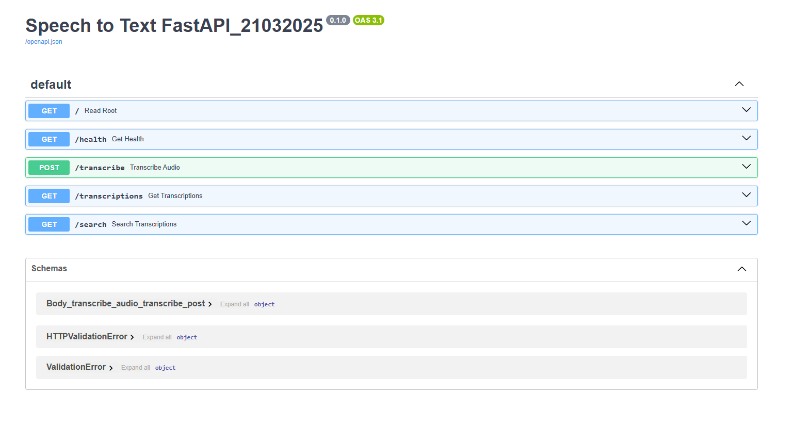

## **Project Description**

This backend is a RESTful API built using FastAPI, designed to process and transcribe audio files using OpenAI’s Whisper-tiny model. The service supports storing transcriptions in an SQLite database and provides search functionality. The backend is also containerized using Docker.
## **Technologies Used**

- **Python**: The primary programming language for building the application.
- **Uvicorn**: ASGI server for running the FastAPI application
- **FastAPI**: A fast, modern web framework for building the API that serves the model predictions.
- **Whisper-tiny**: OpenAI’s lightweight speech-to-text model for transcriptions.
- **SQLite**: A lightweight relational database used for storing transcriptions.
- **Docker**: Containerization tool for packaging and deploying the application.
- **FFmpeg**: A multimedia framework for preprocessing audio files before transcription
# Project Structure
```bash
AI_speech_to_text/
├── backend/
│   ├── app/
│   │   ├── init.py
│   │   ├── main.py                 # starting point of fastapi
│   │   ├── models.py               # db operations
│   │   ├── routers/
│   │   │   ├── __init__.py        
│   │   │   ├── health.py           # endpoint for application healthcheck
│   │   │   ├── search.py           # endpoint to search transcriptions based on filename 
│   │   │   ├── transcribe.py       # endpoint for processing uplaoded sample audio files     
│   │   │   ├── transcriptions.py   # endpoint for to retrieve all past transcriptions
│   │   ├── utils/
│   │   │   ├── __init__.py        
│   │   │   ├── file_utils.py    # to generate unique name for file (in case of same filename already exist in db)    
│   │   │   ├── whisper.py
│   │   ├── test/
│   │   │   ├── __init__.py        
│   │   │   ├── test_getalltranscriptions.py    # to generate unique name for file (in case of same filename already exist in db)    
│   │   │   ├── test_search.py  
│   │   │   ├── test_transcribe.py 
│   ├── Dockerfile               # containerization
│   ├── requirements.txt         # dependencies
│   ├── README.md                # documentation
│   ├── setup.sh                 # script to setup backend
```

## **Pre-Requisites**
- Python Version: 3.12.3
- OS: Windows 11 OS
- Git bash (If using windows)

- Install FFMPEG (for audio processing)

   - Please refer to [FFMPEG Download](https://www.ffmpeg.org/download.html)

## **Installation Instructions**

To run the project, you’ll need to install the following dependencies. You can set up your environment and install the required packages using the `requirements.txt` file.

## **Installation (script)**
[Installation by script demo (VIDEO)](https://www.youtube.com/watch?v=I0Gz_oBWGEw)
### 1. Clone the Repository:
```bash
git clone https://github.com/mikechngwk/AI_speech_to_text.git
cd AI_speech_to_text/
```
### 2. Run setup script with gitbash:
Ensure you are in `/AI_speech_to_text/backend` directory.
- Open **gitbash** in current directory and run (Windows):
- Open **terminal** in current directory and run (MacOS):

```bash
bash setup.sh
```
### 3. Test the API

Once up & running, visit:
- **Swagger UI**: http://127.0.0.1:8000/docs#

## **Installation (manual)**
### 1. Clone the Repository:
```bash
git clone https://github.com/mikechngwk/AI_speech_to_text.git
cd AI_speech_to_text/
```
### 2. Set up your virtual environment (optional but recommended):

```bash
python -m venv venv
```

### 3. Activate the virtual environment:

- On **Windows (Using gitbash)**:
```bash
source .venv\Scripts\activate
```

- On **macOS/Linux**:
```bash
source venv/bin/activate
```
### 4. Install the dependencies:
Once the virtual environment is activated, run the following command to install all the required packages:
```bash
cd backend/
pip install -r requirements.txt
```

### 5. Running the Application:
After installing the dependencies, you can run the FastAPI server with the following command, ensure you are inside `backend` directory:
```bash
uvicorn app.main:app
```

### 6. Test the API

Once up & running, visit:
- **Swagger UI**: http://127.0.0.1:8000/docs

## **Setup with Docker**

### Containerization:

```bash
docker build -t speech-transcription-backend .
```
### Run the Container:

```bash
docker run -p 8000:8000 speech-transcription-backend
```


## **API Endpoints**
**Health Check**

- **Endpoint**: GET /health
- **Description**: Checks if backend Service is up and running
- **Response**: 
```json
{
  "status": "ok"
}
```

**Transcribe audio files**

- **Endpoint**: POST /transcribe
- **Description**: Uploads an audio file and returns the transcription
- **Response**: 
```json
{
  "filename": "Sample1_123456.mp3",
  "transcription": "Testing Transcription 1 2 3"
}
```

**Retrieve All Transcriptions**

- **Endpoint**: GET /transcriptions
- **Description**: Fetches all stored transcriptions
- **Response**: 
```json
{
  "transcriptions": [
    {
      "filename": "Sample 2_411d0546adec4b04b2a776568d652097.mp3",
      "transcription": "Help me. I can't find my parents. They told me to wait for them, but I saw this pretty butterfly and followed it. Now I am lost.",
      "created_at": "2025-03-24 20:49:38.499936"
    },
    {
      "filename": "Sample 3_97ff9db417c645158b887c8260470198.mp3",
      "transcription": "What should I have for lunch? There's only young tofu, western, Japanese, economic rice stalls here. I'm sick of the choices here.",
      "created_at": "2025-03-24 20:50:16.758419"
    },
    {
      "filename": "Sample 3_d5ad65bcd60c4b3aa43b31008d5e0bc0.mp3",
      "transcription": "What should I have for lunch? There's only young tofu, western, Japanese, economic rice stalls here. I'm sick of the choices here.",
      "created_at": "2025-03-24 21:04:46.446452"
    }
  ]
}
```
**Search Transcriptions**

- **Endpoint**: GET /search?query=<file_name>
- **Description**: Searches transcriptions by file name
- **Response**: 
```json
{
  "results": [
    {
      "filename": "Sample 2_411d0546adec4b04b2a776568d652097.mp3",
      "transcription": "Help me. I can't find my parents. They told me to wait for them, but I saw this pretty butterfly and followed it. Now I am lost.",
      "created_at": "2025-03-24 20:49:38.499936"
    }
  ]
}
```
### FastAPI Page:


