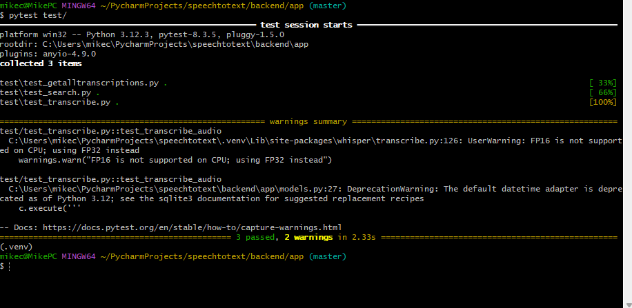

## **Backend Test Cases Setup Guide**
This README provides instructions for setting up and running the test cases for the backend API built with FastAPI. The test cases validate the core functionality of the API endpoints, such as transcribing audio files, retrieving transcriptions, and searching transcriptions.

## **Technologies Used**
- **pytest**: Framework for writing and running the tests.
- **TestClient**: Part of FastAPI for simulating HTTP requests to the API.
- **FastAPI**: A fast, modern web framework for building the API that serves the model predictions.
- **unittest.mock**: For mocking dependencies during tests.


## **Installation Instructions**

To run the project, you’ll need to install the following dependencies. You can set up your environment and install the required packages using the `requirements.txt` file.

## **Installation**
[How to run backend test cases demo (VIDEO)](https://www.youtube.com/watch?v=n6steEE0A7Q)
### 1. Clone the Repository:
```bash
git clone https://github.com/mikechngwk/AI_speech_to_text.git
cd AI_speech_to_text/
```
### 2. Set up your virtual environment:

```bash
python -m venv venv
```

### 3. Activate the virtual environment:

- On **Windows (Using gitbash)**:
```bash
source .venv\Scripts\activate
```

- On **macOS/Linux**:
```bash
source venv/bin/activate
```
### 4. Install the dependencies:
Once the virtual environment is activated, run the following command to install all the required packages:
```bash
pip install -r requirements.txt
```

### 4. Install the test dependencies:
```bash
pip install pytest
```

## **Test Cases Overview**
**test_get_transcriptions**
- This test case checks if the `/transcriptions` endpoint correctly returns all stored transcriptions
- **Sends a GET request to**: `/transcriptions`

```python
def test_get_transcriptions():
    response = client.get("/transcriptions")

    print("Response content:", response.text)

    assert response.status_code == 200
    assert "transcriptions" in response.json()
    assert isinstance(response.json()["transcriptions"], list)

```
**test_search_transcriptions**
- This test case checks if the `/search ` endpoint successfully searches for a transcription by filename.
- Mock the `search_transcriptions` function to simulate a search result.
- **Sends a GET request to**: `/search?filename=<filename>`

```python
@patch("app.models.search_transcriptions")
def test_search_transcriptions(mock_search):
    mock_search.return_value = [{"filename": "test_audio.mp3", "transcription": "Test transcription content"}]

    filename = "test_audio.mp3"

    response = client.get(f"/search?filename={filename}")

    print("Response content:", response.text)

    assert response.status_code == 200
    assert "results" in response.json()
    assert filename in [result['filename'] for result in response.json()["results"]]
```
**test_transcribe_audio**
- This test case checks if the `/transcribe  ` endpoint successfully processes an audio file and returns the transcription.
- **Opens an audio file** from the local filesystem <-- save an audio file and input the filepath under `audio_path` in the code (shown below how to do it too)
- **Sends a [POST] request to**: `/transcribe`

```python
def test_transcribe_audio():
    #relative path to the audiofile
    base_path = os.path.dirname(os.path.abspath(__file__))  
    audio_path = os.path.join(base_path, "uploads", "testaudio.mp3")  

    with open(audio_path, "rb") as f:
        files = {"file": ("test_audio.mp3", f, "audio/mpeg")}

        response = client.post("/transcribe", files=files)

        print("this is response =", response.text)  

        assert response.status_code == 200
```
## Running the Tests
Once you've set up your environment and installed the dependencies, you can run the test cases using `pytest`.
### 1. Run all tests:
```bash
cd /speechtotext/backend/app
pytest test/
```
### 2. Run specific tests:
```bash
cd /speechtotext/backend/app/test
pytest test_search.py
```
### Test result (desired):


