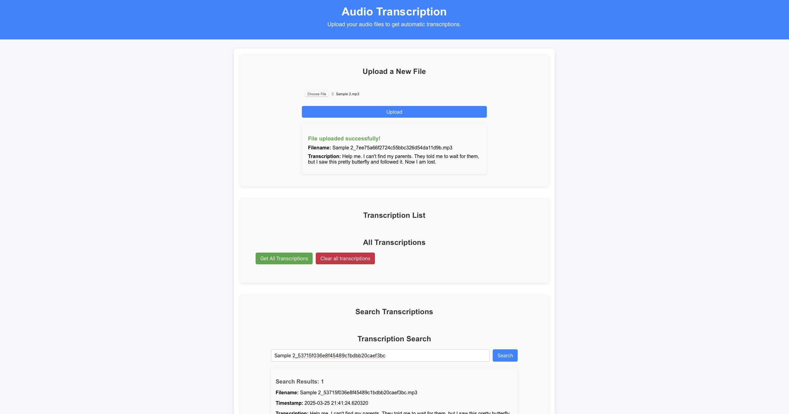

## **Project Description**

This frontend is a Single-Page Application (SPA) built using react, designed to interact with the backend Speech-to-Text Transcription API. Users can upload audio files, retrieve transcriptions, and search for transcriptions stored in the database. The application provides a user-friendly interface for managing audio-to-text conversion efficiently.
## **Technologies Used**

- **React**: Modern JavaScript framework for building a responsive UI.
- **Axios**: Handles API requests to communicate with the backend.
- **State Management**: React Context
# Project Structure
```bash
AI_speech_to_text/
├── frontend/
│   ├── src/
│   │   ├── components/
│   │   │   ├── FileUpload.js       
│   │   │   ├── TranscriptionList.js          
│   │   │   ├── TranscriptionSearch.js          
│   ├── App.js               
│   ├── App.css         
│   ├── index.css               
│   ├── index.js                
```

## **Pre-Requisites**
- Node.js: Version 18+
- Package Manager: npm
- Git bash (If using windows)

## **Installation Instructions**
[Installation demo (VIDEO)](https://youtu.be/z8k9XFEVN7M)
### 1. Clone the Repository:
```bash
git clone https://github.com/mikechngwk/AI_speech_to_text.git
cd AI_speech_to_text/frontend
```
### 2. Install Dependencies:
Ensure you are in `/AI_speech_to_text/frontend` directory.
- Open **gitbash** in current directory and run (Windows):
- Open **terminal** in current directory and run (MacOS):

```bash
npm install
npm start
```
### 3. Test the React SPA
https://localhost:3000

## **Installation by Docker**
[Installation demo by docker (VIDEO)](https://youtu.be/qvEIq3kvcY0)
```bash
docker build -t speech-transcription-frontend .
docker run -d -p 3000:80 speech-transcription-frontend
```

## **Application Features**
**File Upload**
- Upload audio file for transcription


**Retrieve all transcriptions**

- List all transcriptions retrieved from the backend
- Show timestamp,filename and transcripted text

**Search transcription by filename**


- **Endpoint**: GET /search?query=<file_name>
- **Description**: Searches transcriptions by file name
- **Response**: 

### Frontend Page:


## **Frontend Test**
For detailed testing instructions, please refer to:
- [Frontend_Test README](frontend/src/components/__tests__/README.md)

