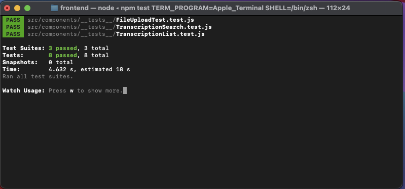

## **Front Test Cases Setup Guide**
This README provides instructions for setting up and running the test cases for the frontend of the speech-to-text application. The test cases validate core functionalities such as rendering components, API calls, and user interactions.

## **Installation Instructions**

## **Installation**
[How to run frontend test cases demo (VIDEO)](https://youtu.be/nHfjJDYDcSw)
### 1. Clone the Repository:
```bash
git clone https://github.com/mikechngwk/AI_speech_to_text.git
cd AI_speech_to_text/frontend
```
### 2. Install the dependencies:

```bash
npm install
```

### 3. Install the test dependencies:

- On **Windows (Using gitbash)**:
- On **MAC use terminal**
```bash
npm install --save-dev jest @testing-library/react @testing-library/jest-dom msw cypress
```
### 4. Running the tests:
- On **Windows (Using gitbash)**:
- On **MAC use terminal**
```bash
npm test
``````

### Test result (desired):


